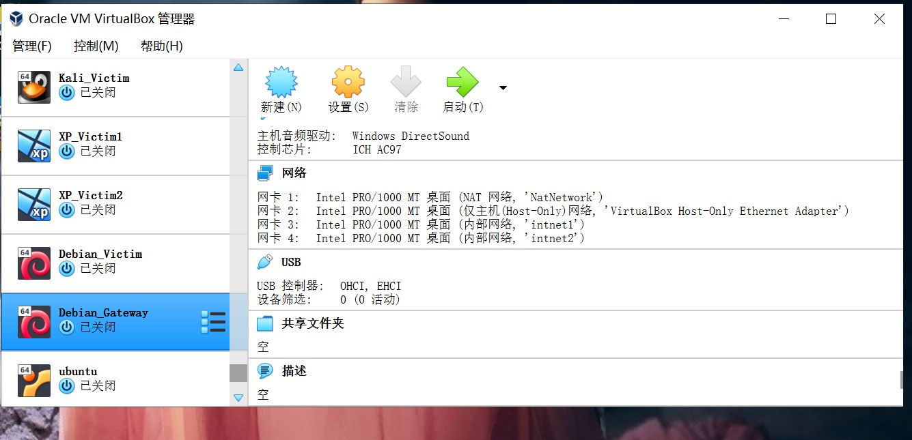
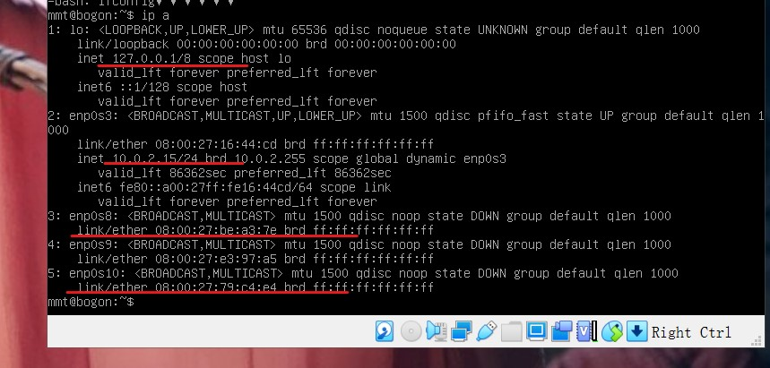

## 第一章：基于 VirtualBox 的网络攻防基础环境搭建

#### 实验目的

* 掌握 VirtualBox 虚拟机的安装与使用；
* 掌握 VirtualBox 的虚拟硬盘多重加载；
* 掌握 VirtualBox 的虚拟网络类型和按需配置；

#### 实验环境
* VirtualBox 虚拟机
* 攻击者主机（Attacker）：Kali Rolling 2020.3 x64
* 网关（Gateway）：Debian Buster
* 靶机（Victim）：
    + Kali Rolling 2020.3 x64
    + Debian Buster
    + Windows XP Professional with Service Pack 3 (x86) - CD VL (Chinese-Simplified)

#### 实验要求

* [x] 靶机可以直接访问攻击者主机
* [x] 攻击者主机无法直接访问靶机
* [x] 网关可以直接访问攻击者主机和靶机
* [x] 靶机的所有对外上下行流量必须经过网关
* [x] 所有节点均可以访问互联网

#### 实验内容

1. 虚拟机的安装
   * kali使用官网的ova
   * debian使用老师要求的镜像，安装 OpenSSH Server 和 standard system utilities。
   * xp使用老师发的镜像。


2. 虚拟机实现多重加载。


3. 搭建拓扑网络结构


**新建NATNetwork**


**Debian网关配置**
+ 配置四块网卡


+ 未配置的ip地址


+ 先配置host-only网卡，对应enp0s8。
    ```
    vi /etc/network/interface
    allow-hotplug enp0s8
    iface enp0s8 inet dhcp
    ```

* 配置完成后PuTTy连接虚拟机(刚开始我的host-only网段是手动分配，后来发现手动分配我的电脑ping不通虚拟机！就改成了自动)


* 修改网络配置文件
    `vi /etc/network/interfaces`，将该链接中etc-network-interfaces部分粘贴到文件中：https://gist.github.com/c4pr1c3/8d1a4550aa550fabcbfb33fad9718db1
    修改完成，执行`systemctl restart networking`,重启网络服务
    再将关闭的网卡打开，如: 
        ```
        /sbin/ifup enp0s3
        /sbin/ifup enp0s8
        /sbin/ifup enp0s9
        ```
    最后的ip地址结果


* 安装并配置dnsmasq
    ```
    apt update && apt install dnsmasq
    vi /etc/dnsmasq.conf
    vi /etc/dnsmasq.d/gw-enp010.conf
    vi /etc/dnsmasq.d/gw-enp09.conf
    ```
    将该链接中对应文件的内容分别写入：https://gist.github.com/c4pr1c3/8d1a4550aa550fabcbfb33fad9718db1

**Kali-Attacker**


**Kali-Victim**


**XP_Victim1**

* 先根据网关的intnet1的地址手动分配ip地址，关掉防火墙

* 可以单方向ping通网络

* IP地址


**XP_Victim2**


**Debian_Victim**


**各个虚拟机对应的ip地址**
|  名称   | IP地址  |
|  ----  | ----  |
|  Kali-Attacker | 10.0.2.4 |
|  Kali-Victim | 172.16.111.135 |
|  XP_Victim1  | 172.16.111.101  |
|  XP_Victim2  | 172.16.222.145  |
|  Debian_Victim  | 172.16.222.112 |
|  Debian_gateway  |  10.0.2.15/24 （NATNetwork) |
|   |192.168.56.106/24 (Host Only)  |
|   |172.16.111.1/24（内部网络 intnet1) |
|   |172.16.222.1/24（内部网络 intnet2）|

**网络连通性测试**
* [x] 靶机可以直接访问攻击者主机


* [x] 攻击者主机无法直接访问靶机


* [x] 网关可以直接访问攻击者主机和靶机


* [x] 靶机的所有对外上下行流量必须经过网关
* [x] 所有节点均可以访问互联网

* 在网关上安装`tcpdump`，对网卡进行监控。在各个节点上访问互联网，观察捕获到了上下行的包。关闭网关，发现所有节点都无法访问互联网，说明靶机的所有对外上下行流量必须经过网关。
```
apt insatll tcpdump
/usr/sbin/tcpdump -i enp0s8
/usr/sbin/tcpdump -i enp0s9
/usr/sbin/tcpdump -i enp0s10
```

+ Kali_Attacker可以正常上网


+ Kali_Victim可以正常上网


+ Kali_Victim上下流量通过网关


+ Debian_Victim可以正常上网


+ Debian_Victim上下流量通过网关


+ XP_Victim1可以正常上网


+ XP_Victim1上下流量通过网关


+ XP_Victim2可以正常上网


+ XP_Victim2上下流量通过网关


* 关闭网关后，四台靶机不能正常访问网络


