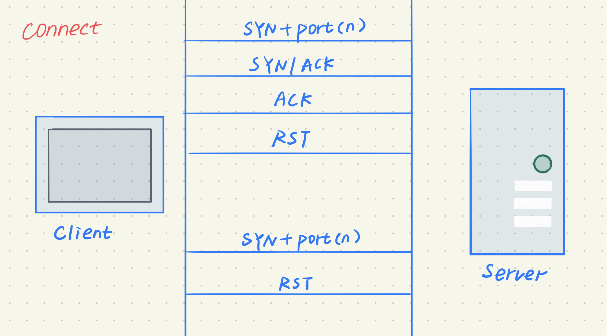

## 第五章 基于 VirtualBox 的网络攻防基础环境搭建

### 实验要求
- [x] 禁止探测互联网上的 IP ，严格遵守网络安全相关法律法规
- [x] 完成以下扫描技术的编程实现
  - TCP connect scan / TCP stealth - scan
  - TCP Xmas scan / TCP fin scan / - TCP null scan
  - UDP scan
- [x] 上述每种扫描技术的实现测试均需要测试端口状态为：开放、关闭 和 过滤 状态时的程序执行结果
- [x] 提供每一次扫描测试的抓包结果并分析与课本中的扫描方法原理是否相符？如果不同，试分析原因；
- [x] 在实验报告中详细说明实验网络环境拓扑、被测试 IP 的端口状态是如何模拟的
- [x] 复刻 nmap 的上述扫描技术实现的命令行参数开关

### 实验环境

1. 拓扑结构
把攻击者主机和靶机放入一个局域网中，将kali-Attacker的网卡1设置为内部网络，并根据第一章的知识启用DHCP服务器和网卡eth0


2. 网络配置


3. 网络连通测试
- Kali-Attacker


- Kali-Victim


- 攻击者和靶机都开了两块网卡，网卡1是内部网络，网卡2是host-only网卡，方便VSCode连接虚拟机(~~为了字大复制粘贴方便和编辑py文件方便~~)(~~顺便证明我的结果都是我亲自跑了的，因为我VScode有着美丽且独特的紫色背景~~)

### 实验过程

- 在Attacker上更新python环境至python3.8
    ```
    wget https://www.python.org/ftp/python/3.8.0/Python-3.8.0.tgz
    tar -zxvf Python-3.8.0.tgz
    ./configure --enable-optimizations --prefix=/home/kali/Python3/ && make && make install
    ln -s /home/kali/Python3/bin/python3.8  /usr/bin/python
    ```

- 端口扫描

结果显示除了SSH端口开放没有别的端口开放

##### 扫描技术实现

#### TCP connect scan
- 实现原理
    开放状态：接收到的是一个 SYN/ACK 数据包
    关闭状态：接收到的是一个 RST/ACK 数据包
    过滤状态：目标主机没有任何响应



- 实验结果

##### closed

- Attacker


- 利用wireshark分析Victim抓包结果

    + Attacker给Victim的80端口发送了设置SYN标志的TCP包
    + Victim发送给Attackers的返回包中设置了RST标志
    + 证明了端口关闭，与课本中的扫描方法原理相符

##### open
- Victim开启80端口


- Attacker


- wireshark分析Victim抓包结果

    + Attacker和Victim之间进行了完整的3次握手TCP通信（SYN, SYN/ACK, 和RST）
    + 并且该连接由Attacker在最终握手中发送确认ACK+RST标志来建立
    + 证明了端口打开，与课本中的扫描方法原理相符

##### filtered

- Victim将80端口设为拒绝状态并在防火墙中过滤


- Attacker


- wireshark分析Victim抓包结果

    + Attacker给Victim的80端口发送了设置SYN标志的TCP包
    + Victim未返回TCP数据包给攻击者
    + Victim返回给攻击者一个ICMP数据包
    + 证明了端口被过滤，与课本中的扫描方法原理相符


#### TCP stealth scan

- 实现原理


类似于TCP连接扫描。但是最后在TCP数据包中发送的是RST标志而不是RST + ACK。

- 实验结果

##### closed

- Victim


- Attacker


- wireshark分析Victim抓包结果

    + Attacker给Victim的80端口发送了设置SYN标志的TCP包
    + Victim发送给Attacker的返回包中设置了RST标志
    + 证明了端口关闭，与课本中的扫描方法原理相符

##### open

- Victim开启80端口


- Attacker


- wireshark分析Victim抓包结果

    + Attacker和Victim之间进行了完整的3次握手TCP通信（SYN, SYN/ACK, 和RST）
    + 并且该连接由Attacker在最终握手中发送确认ACK+RST标志来建立
    + 证明了端口打开，与课本中的扫描方法原理相符

##### filtered

- Victim将80端口设为拒绝状态并在防火墙中过滤


- Attacker


- wireshark分析Victim抓包结果

    + Attacker给Victim的80端口发送了设置SYN标志的TCP包
    + Victim未返回TCP数据包给攻击者
    + Victim返回给攻击者一个ICMP数据包
    + 证明了端口被过滤，与课本中的扫描方法原理相符

#### TCP XMAS scan

- 实现原理


Xmas发送一个TCP包，并对TCP报文头FIN、URG和PUSH标记进行设置。若是关闭的端口则响应 RST 报文；开放或过滤状态下的端口则无任何响应

- 实验结果

##### closed

- Victim


- Attacker


- wireshark分析Victim抓包结果

    + Attacker给Victim的80端口发送设置了PSH，FIN和URG标志的TCP数据包
    + Victim发送给Attacker的返回包中设置了**RST**,ACK标志
    + 证明了端口关闭，与课本中的扫描方法原理相符

##### open

- Victim开启80端口


- Attacker


- wireshark分析Victim抓包结果

    + Attacker给Victim的80端口发送了设置了PSH，FIN和URG标志的TCP数据包
    + Victim没有发送TCP包响应，无法区分其80端口打开/被过滤
    + 但是Victim也没有发送ICMP数据包给Attacker，说明端口不是被过滤状态
    + 证明了端口打开，与课本中的扫描方法原理相符

##### filtered

- Victim将80端口设为拒绝状态并在防火墙中过滤


- Attacker


- wireshark分析Victim抓包结果

    + Attacker给Victim的80端口发送了发送了设置了PSH，FIN和URG标志的TCP包
    + Victim未返回TCP数据包给攻击者
    + Victim返回给攻击者一个ICMP数据包
    + 证明了端口被过滤，与课本中的扫描方法原理相符

#### TCP fin scan

- 实验结果

##### closed

- Victim


- Attacker


- wireshark分析Victim抓包结果

    + Attacker给Victim的80端口发送设置了FIN标志的TCP数据包
    + Victim发送给Attacker的返回包中设置了**RST**,ACK标志
    + 证明了端口关闭，与课本中的扫描方法原理相符

##### open

- Victim开启80端口


- Attacker


- wireshark分析Victim抓包结果

    + Attacker给Victim的80端口发送了设置了FIN标志的TCP数据包
    + Victim没有发送TCP包响应，无法区分其80端口打开/被过滤
    + 但是Victim也没有发送ICMP数据包给Attacker，说明端口不是被过滤状态
    + 证明了端口打开，与课本中的扫描方法原理相符

##### filtered

- Victim将80端口设为拒绝状态并在防火墙中过滤


- Attacker


- wireshark分析Victim抓包结果

    + Attacker给Victim的80端口发送了发送了设置了FIN标志的TCP包
    + Victim未返回TCP数据包给攻击者
    + Victim返回给攻击者一个ICMP数据包
    + 证明了端口被过滤，与课本中的扫描方法原理相符

#### TCP null scan

- 实验结果

##### closed

- Victim


- Attacker


- wireshark分析Victim抓包结果

    + Attacker给Victim的80端口发送一个没有任何标志位的TCP数据包
    + Victim发送给Attacker的返回包中设置了**RST**,ACK标志
    + 证明了端口关闭，与课本中的扫描方法原理相符

##### open

- Victim开启80端口


- Attacker


- wireshark分析Victim抓包结果

    + Attacker给Victim的80端口发送了一个没有任何标志位的TCP数据包
    + Victim没有发送TCP包响应，无法区分其80端口打开/被过滤
    + 但是Victim也没有发送ICMP数据包给Attacker，说明端口不是被过滤状态
    + 证明了端口打开，与课本中的扫描方法原理相符

##### filtered

- Victim将80端口设为拒绝状态并在防火墙中过滤


- Attacker


- wireshark分析Victim抓包结果

    + Attacker给Victim的80端口发送了发送了一个没有任何标志位的TCP包
    + Victim未返回TCP数据包给攻击者
    + Victim返回给攻击者一个ICMP数据包
    + 证明了端口被过滤，与课本中的扫描方法原理相符

#### UDP scan

- 实现原理


如果收到一个 ICMP 不可到达的回应，则认为这个端口是关闭的
如果目标主机安装有防火墙或其它可以过滤数据包的软硬件,那我们发出 UDP 数据包后,将可能得不到任何回应,我们将会见到所有的被扫描端口都是开放的

- 实验结果

##### closed

- Attacker


- wireshark分析Victim抓包结果

    + Attacker给Victim的80端口发送一个UDP数据包
    + Victim响应ICMP端口不可达错误type3和code3
    + 证明了端口关闭，与课本中的扫描方法原理相符

##### open

- Victim开启80端口


- Attacker


- wireshark分析Victim抓包结果

    + Attacker给Victim的80端口发送了一个UDP数据包
    + Victim开启了防火墙，发出的数据包没有得到任何回应，所以是开放或者过滤状态。

##### filtered

- 实验结果同开放状态

##### 复刻 nmap 的上述扫描技术实现的命令行参数开关
1. TCP connect scan
    ```
    nmap 172.16.111.135 -p 80 -sT -n -T4 -vv
    ```


2. TCP stealth scan
    ```
    nmap 172.16.111.135 -p 80 -sS -n -T4 -vv
    ```


3. TCP Xmas scan
    ```
    nmap 172.16.111.135 -p 80 -sX -n -T4 -vv
    ```


4.  fin scan
    ```
    nmap 172.16.111.135 -p 80 -sF -n -T4 -vv
    ```


5. TCP null scan
    ```
    nmap 172.16.111.135 -p 80 -sN -n -T4 -vv
    ```


6. UDP scan
    ```
    nmap 172.16.111.135 -p 80 -sU -n -T4 -vv
    ```


#### 遇到的问题

1. 刚开始运行py文件总是在输出的结果前报错，比如：

上网查资料后，说是错误原因：在命令行调用了图形化接口(不知道什么原因，甚至以为python环境变量设置出了问题，差点把环境改坏掉)，加上以下代码就不报错了
    ```
    import matplotlib 
    matplotlib.use('Agg') 
    ```
    如下：


但是由于~~偷懒~~时间关系有的代码没改，但是不影响输出结果，只影响输出长度...

2. 这个实验真的好麻烦(截图圈图心好累)，我做到Xmas的时候open结果跟前两个不同，我一直以为出错了，后来发现原理变了我没记住，并且一直调试网卡状态耗费时间
端口状态用`iptables -A INPUT -p tcp -m tcp --dport 80 -j REJECT`设置过滤后，就一直变成了过滤，改不过来
试着改的命令：
    ```
    iptables -A INPUT -p tcp -m tcp --dport 80 -j ACCEPT
    ufw enable && ufw allow 80/tcp
    ```
    并不奏效，最后采用重启大法

3. 发现了kali的ssh服务打开不会自启动

4. 找的网络拓扑图在线绘制网站无法使用，所以手画的，求推荐工具

#### 参考资料
[解决 ‘GDK_IS_DISPLAY (display)‘ failed](https://blog.csdn.net/qq_19707521/article/details/108277325)

[Kali开启ssh服务](https://blog.csdn.net/qq_37113223/article/details/107361440)

[Kali环境下安装python3.8](https://www.cnblogs.com/LilRind/p/13505477.html)

[师姐的作业](https://github.com/CUCCS/2019-NS-Public-cjx2017/blob/ns-chap0x05/ns-chap0x05/%E5%9F%BA%E4%BA%8E%20Scapy%20%E7%BC%96%E5%86%99%E7%AB%AF%E5%8F%A3%E6%89%AB%E6%8F%8F%E5%99%A8.md#1tcp-connect-scan-1)

[课本](https://github.com/CUCCS/2019-NS-Public-cjx2017/blob/ns-chap0x05/ns-chap0x05/%E5%9F%BA%E4%BA%8E%20Scapy%20%E7%BC%96%E5%86%99%E7%AB%AF%E5%8F%A3%E6%89%AB%E6%8F%8F%E5%99%A8.md#1tcp-connect-scan-1)
