## 第九章：Snort

### 实验目的
- 进行入侵检测的软件实现体验

### 实验要求
- 通过配置snort不同规则来进行网络入侵检测

### 实验环境
- Debian buster
    + 网卡1 ：Natnetwork
    + 网卡2 ：Host-only网卡

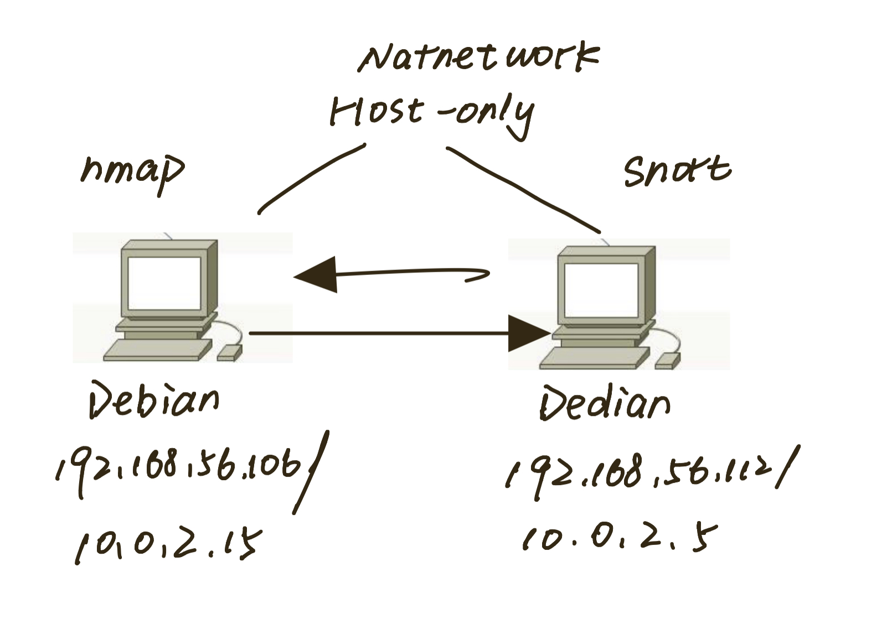
- 两台电脑可互通

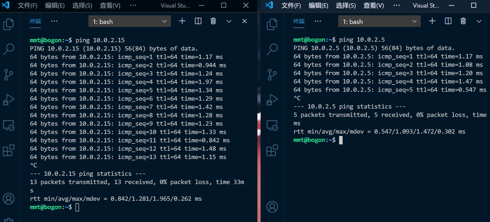
- snort
- pfstp

### 实验过程

#### 实验一：配置snort为嗅探模式

- 安装snort
```
# 禁止在apt安装时弹出交互式配置界面
export DEBIAN_FRONTEND=noninteractive
(但其实安装的时候还是弹出了界面)

apt install snort
```
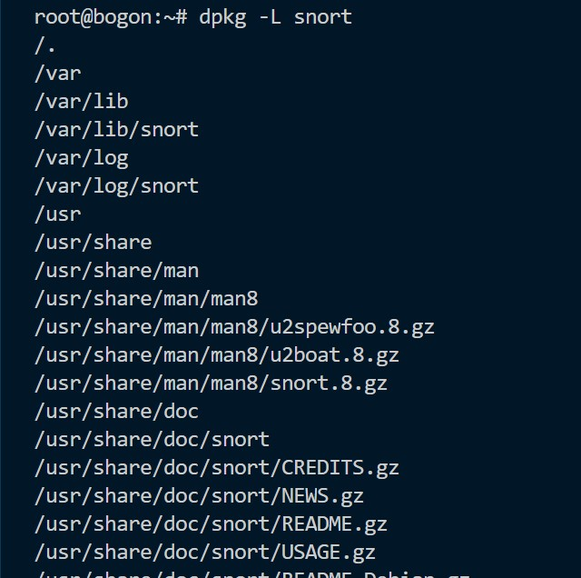

- **配置snort为嗅探模式**

```
# 显示IP/TCP/UDP/ICMP头
snort –v

# 显示应用层数据
snort -vd

# 显示数据链路层报文头
snort -vde

# -b 参数表示报文存储格式为 tcpdump 格式文件
# -q 静默操作，不显示版本欢迎信息和初始化信息
snort -q -v -b -i enp0s8 "port not 22"

# 使用 CTRL-C 退出嗅探模式
# 嗅探到的数据包会保存在 /var/log/snort/snort.log.<epoch timestamp>
# 其中<epoch timestamp>为抓包开始时间的UNIX Epoch Time格式串
# 可以通过命令 date -d @<epoch timestamp> 转换时间为人类可读格式
# exampel: date -d @1511870195 转换时间为人类可读格式
# 上述命令用tshark等价实现如下：
tshark -i enp0s8 -f "port not 22" -w 1_tshark.pcap
```

- **snort -v**

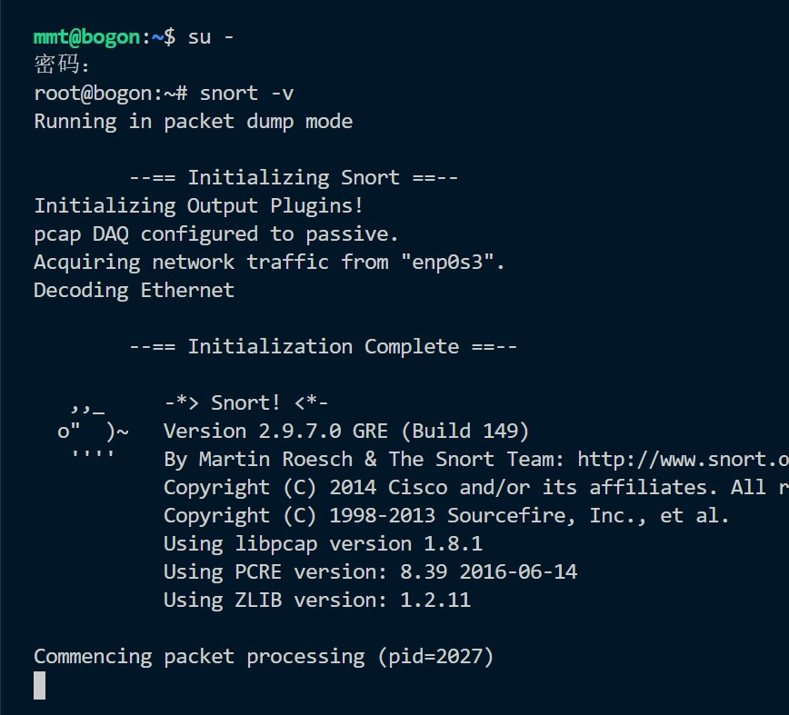


- **ping百度，显示ICMP头**

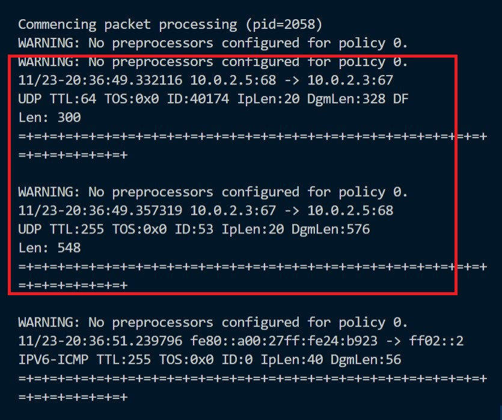

- **应用层数据和数据链路层数据**

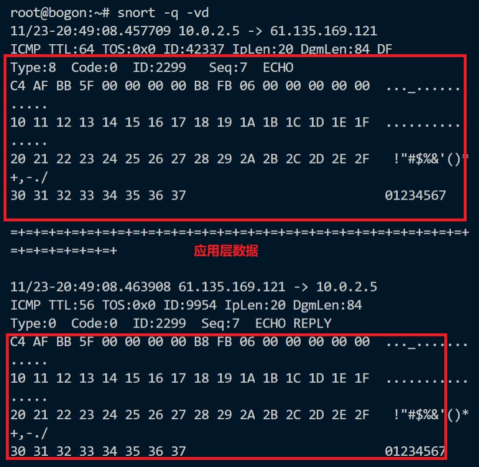
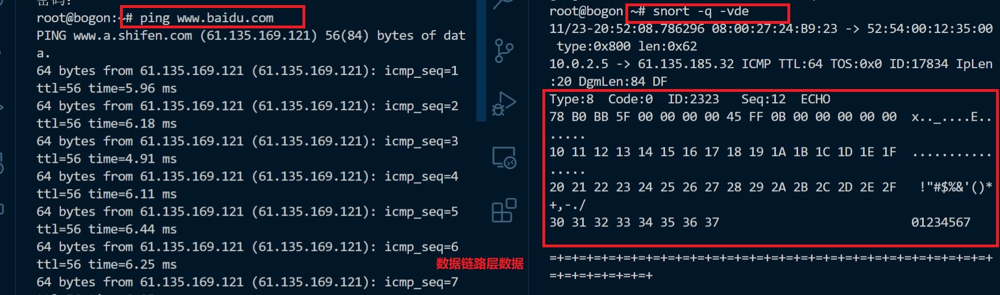

- **将嗅探的数据保存下来`snort -q -v -b -i enp0s8 "port not 22"`**

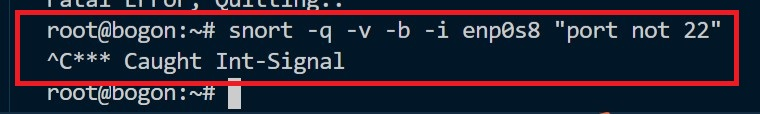
**上述命令用tshark等价实现如下：
tshark -i enp0s8 -f "port not 22" -w 1_tshark.pcap**

- **Ctrl+C停止嗅探**

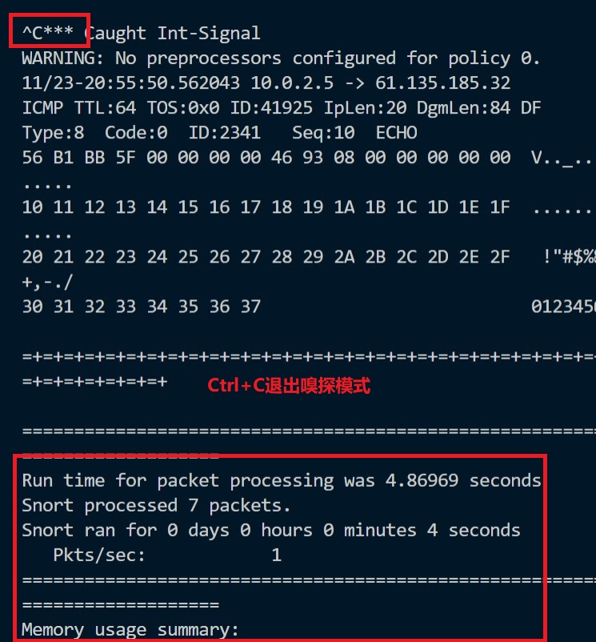

#### 实验二 配置并启用snort内置规则

```
# /etc/snort/snort.conf 中的 HOME_NET 和 EXTERNAL_NET 需要正确定义
# 例如，学习实验目的，可以将上述两个变量值均设置为 any
snort -q -A console -b -i enp0s8 -c /etc/snort/snort.conf -l /var/log/snort/
```

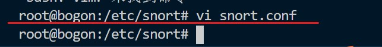
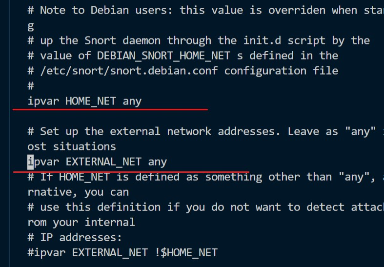

- **启用内置规则**

```
snort -q -A console -b -i enp0s8 -c /etc/snort/snort.conf -l /var/log/snort/
```

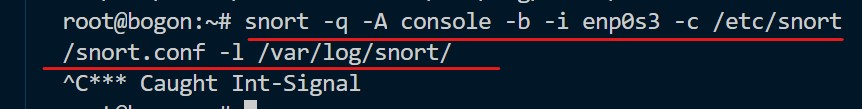

#### 实验三：自定义snort规则

- 新建snort规则文件

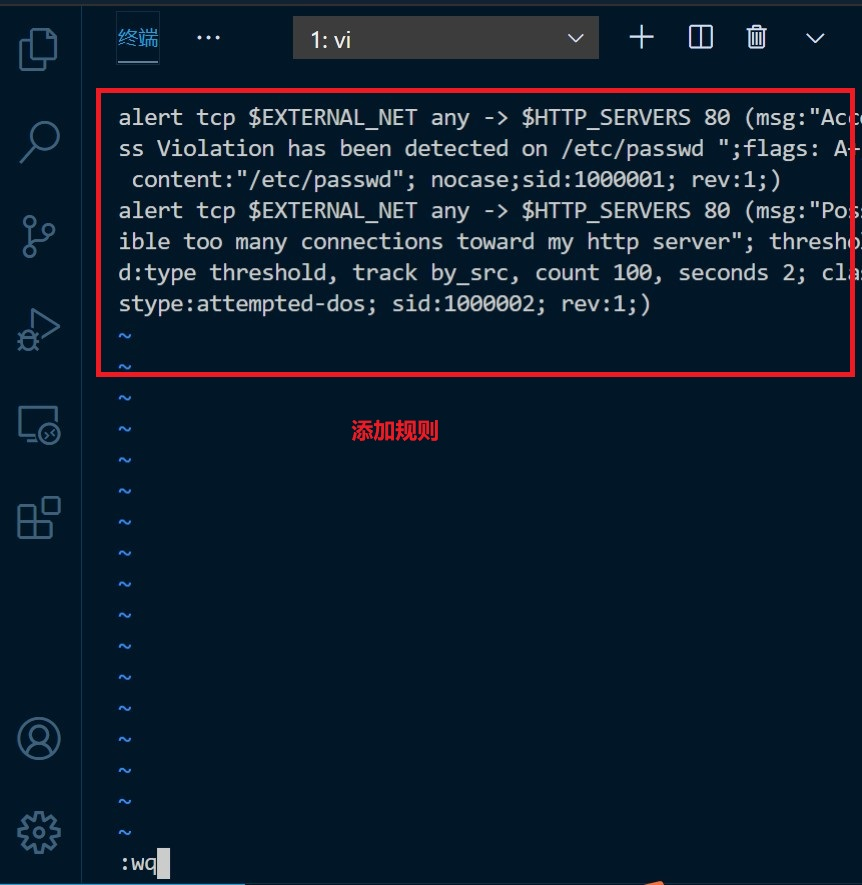

- 添加新的配置到原始配置文件

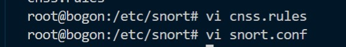
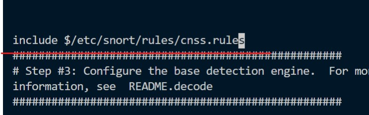

- 启用新的配置
```
snort -q -A console -b 65535 enp0s8 -c /etc/snort/snort.conf -l /var/log/snort/
```

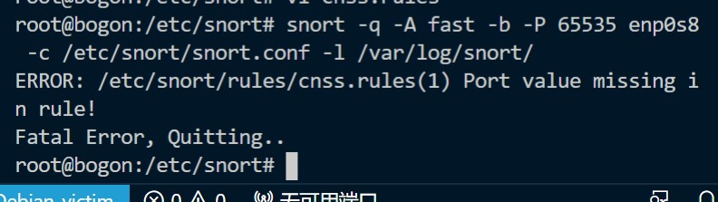
(报错)


#### 实验四 和防火墙联动

- **安装 Guardian**

    + 将压缩包使用pfstp从主机传入虚拟机
    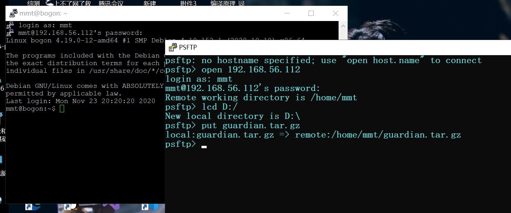
    + 解压缩 Guardian-1.7.tar.gz
    `tar zxf guardian.tar.gz`
    + 安装 Guardian 的依赖 lib
    `apt install libperl4-corelibs-perl`

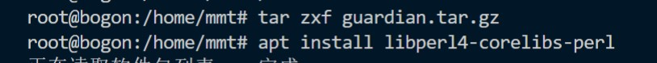

- **配置guardian并运行**

```
# 编辑 guardian.conf 并保存，确认以下2个参数的配置符合主机的实际环境参数。

HostIpAddr      192.168.56.112
Interface       enp0s8
```
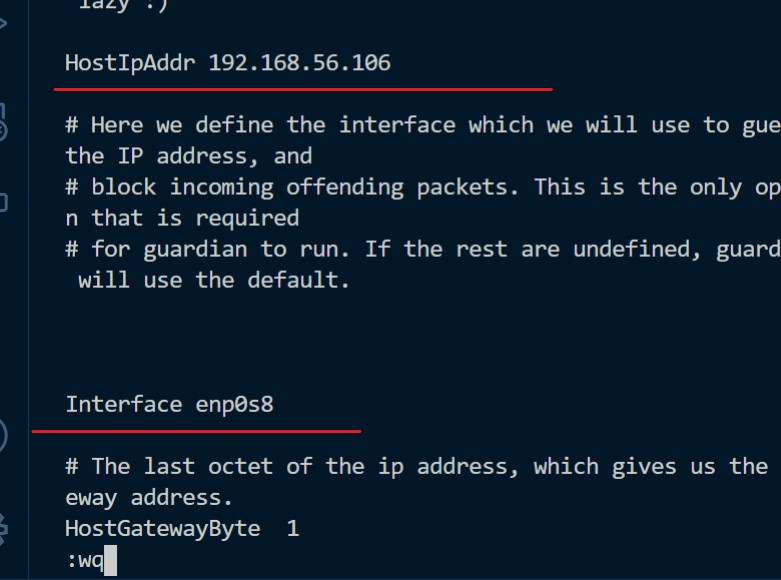

```
# 启动 guardian.pl
perl guardian.pl -c guardian.conf
```
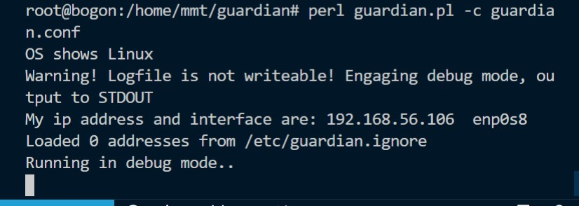

- **另一台主机用nmap扫描**

```
nmap 192.168.56.112 -A -T4 -n -vv
```
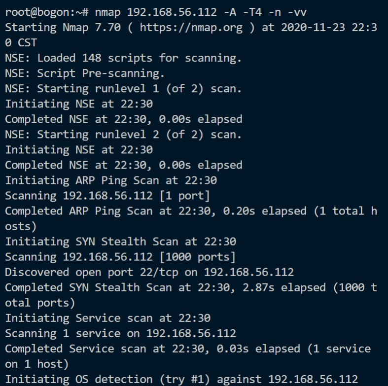

```
guardian.conf 中默认的来源IP被屏蔽时间是 60 秒（屏蔽期间如果黑名单上的来源IP再次触发snort报警消息，则屏蔽时间会继续累加60秒）

root@KaliRolling:~/guardian# iptables -L -n
Chain INPUT (policy ACCEPT)
target     prot opt source               destination
REJECT     tcp  --  10.0.2.6       0.0.0.0/0            reject-with tcp-reset
DROP       all  --  10.0.2.6       0.0.0.0/0

Chain FORWARD (policy ACCEPT)
target     prot opt source               destination

Chain OUTPUT (policy ACCEPT)
target     prot opt source               destination

# 1分钟后，guardian.pl 会删除刚才添加的2条 iptables 规则
root@KaliRolling:~/guardian# iptables -L -n
Chain INPUT (policy ACCEPT)
target     prot opt source               destination

Chain FORWARD (policy ACCEPT)
target     prot opt source               destination

Chain OUTPUT (policy ACCEPT)
target     prot opt source               destination
```

### 遇到的问题
- 安装snort，kali不可以，~~上课老师强调过,甚至在老师提醒我之后记起来了这一段....~~，后又换成Debian，因为默认监听网段在192.168.0/16，所以网卡改为了enp0s8(Host-only网卡)

- 实验三中出现了报错
注释掉改动代码会显示未安装DAQ，于是试着按照[博客](https://blog.csdn.net/xuguokun1986/article/details/52890603)安装DAQ，未解决。终于明白为什么大家执着于装kali，因为kali内置网卡有eth0比较合适......

#### 参考资料

[师姐的作业](https://github.com/CUCCS/2019-NS-Public-chencwx/blob/ns_chap0x09/ns_chapter9/%E5%85%A5%E4%BE%B5%E6%A3%80%E6%B5%8B.md)


