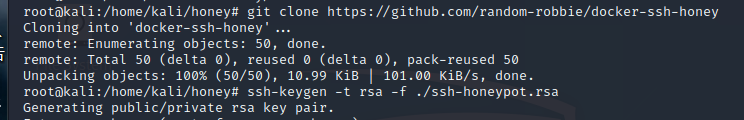
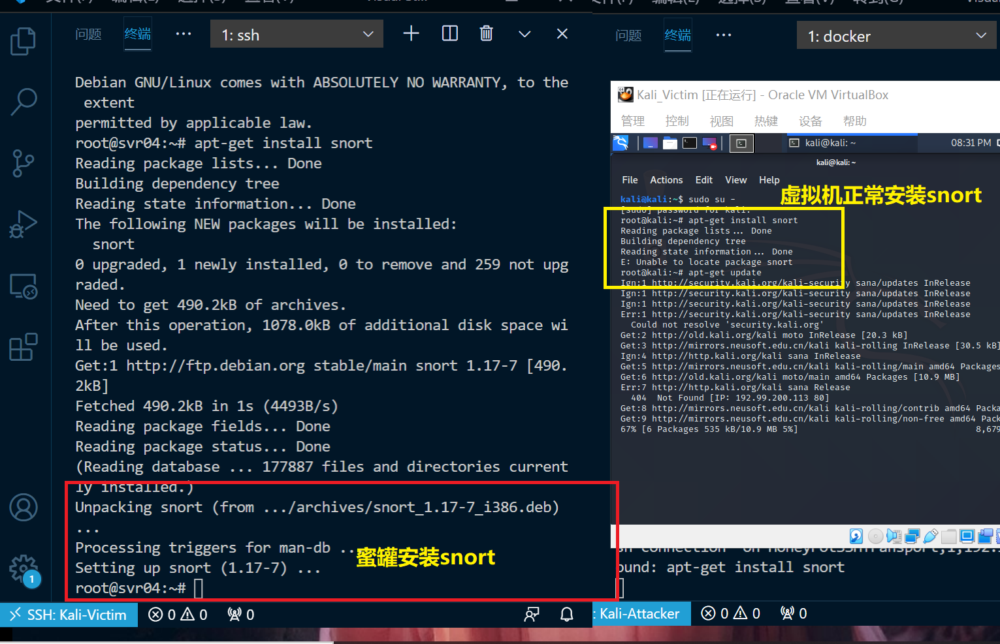
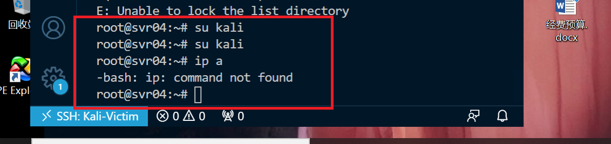

## EXP_11 常见蜜罐体验和探索

### 实验目的

- 了解蜜罐的分类和基本原理
- 了解不同类型蜜罐的适用场合
- 掌握常见蜜罐的搭建和使用

### 实验环境

- ssh-honeypot
- cowrie

### 网络拓扑图


### 实验要求
- [x] 记录蜜罐的详细搭建过程；
- [x] 使用 nmap 扫描搭建好的蜜罐并分析扫描结果，同时分析「 nmap 扫描期间」蜜罐上记录得到的信息；
- [x] 如何辨别当前目标是一个「蜜罐」？以自己搭建的蜜罐为例进行说明；
- [x] （可选）总结常见的蜜罐识别和检测方法；
- [ ] （可选）尝试基于 canarytokens 搭建蜜信实验环境进行自由探索型实验；

### 实验过程
- 检查两台主机是可连通的
- 在Victim上安装docker-ce
    ```
    #添加dockerce源
    apt-get install -y apt-transport-https ca-certificates curl software-properties-common
    #添加密钥
    curl -fsSL https://download.daocloud.io/docker/linux/ubuntu/gpg | sudo apt-key add -
    #安装docker-ce
    apt-get install docker-ce
    #启动服务
    systemctl start docker
    #测试是否安装成功
    sudo docker run hello-world
    ```

    

- Kali自带SSH服务，所以不再安装，开始安装蜜罐


#### 低交互蜜罐——ssh-Honeypot

- 这是一种极低交互式的简易蜜罐，安装ssh-honeypot，首先确保libssh&libjson-c已经安装


- 安装docker-ssh-honeypot
    ```
    git clone https://github.com/random-robbie/docker-ssh-honey
    docker build . -t local:ssh-honeypot#构建镜像
    docker run -p 2234:22 local:ssh-honeypot
    ```
    
    
    

- 进入容器并查看日志，此时日志中没有任何信息
    ```
    docker exec -i -t ef02b4901ab5 bash#进入容器
    tail -F ssh-honeypot.log#查看日志
    ```
    
    
    

- 让attacker对蜜罐所在主机端口进行ssh连接`ssh root@192.168.56.109 -p 2234`，进行观察，发现安装蜜罐的主机日志已经把该行为记录下来了


- 仔细查看日志信息，我们发现攻击者的所有行为都被记录下来了，包括输入的密码以及攻击者的ip。


- 接着attacker对目标主机进行nmap端口扫描，日志信息中并没有记录该动作，说明该蜜罐并未对此生效，也再一次说明了该蜜罐的低交互式，只是一个可以简单记录ssh连接的简易蜜罐
    ```
    #TCP connect scan
    nmap -sT -P 2234 -n -vv 196.168.56.109
    #TCP NULL scans
    nmap -sN -P 2234 -n -vv 196.168.56.109
    #TCP SYN scan
    nmap -sS -P 2234 -n -vv 196.168.56.109
    #TCP ping扫描
    nmap -sP -P 2234 -n -vv 196.168.56.109
    #TCP FIN scans
    nmap -sF -P 2234 -n -vv 196.168.56.109
    #TCP Xmas scans
    nmap -sX -P 2234 -n -vv 196.168.56.109
    ```
    
    
    

#### 中交互蜜罐——Cowrie
- 安装cowrie
    ```
    docker pull cowrie/cowrie
    ```

- 启动cowrie，在端口2222开启，同时在attacker中进行ssh连接攻击者,使用正确的密码可以正常登录。

(第一次attacker没有使用root用户，连接失败)

- 然后尝试普通用户登录，发现无应答也无日志记录信息

- 再尝试root用户登录提示信息出现认证用户改变字样，此时再尝试普通用户连接出现了同样的提示信息，此时有了用户记录信息。


查阅提示信息发现，应该要使用`ssh-keygen -f "/root/.ssh/known_hosts" -R "[192.168.56.109]:2222命令删除已有SSH值`删除已有的认证SSH值，才能重新认证，猜想是因为每次连接都会生成一个SSH键值，但不知道为什么不会自动覆盖，要手动删除。

- 仔细观察之前无应答无记录的普通用户连接命令，可能是因为不能用Sudo？？？所以将attacker切换到root用户进行尝试，就可以成功连接了

- 总结：
    + 必须将attacker切换到root用户才能连接
    + root用户输入正确的密码可以连接
    + 普通用户没有权限通过SSH连接
    + 每次建立新的连接，必须使用`ssh-keygen -f "/root/.ssh/known_hosts" -R "[192.168.56.109]:2222命令删除已有SSH值`删除已有的认证SSH值，才能重新连接

- 过了一段时间，ssh连接就自动断开了，说明该蜜罐可能有设置连接时间限制


- 使用`nmap -sT -p 2222 -n -vv 10.0.2.15`等命令扫描没有日志记录信息


- 尝试暴力扫描`nmap 192.168.56.109 -A -T4 -n -vv`有了日志记录信息


### 常见的蜜罐识别和检测方法总结

- 从实验中，可以总结以下经验
    + 很多命令蜜罐与普通真机的执行结果都会不同，通过这个能初步判断“陷入”了蜜罐的陷阱中;
    + 在进行ssh连接时，发现任意密码都能登录，这也是暴露点之一；
    + 在目录中看不到应有的配置文件的存在，这也许是蜜罐搭建者想刻意隐瞒的信息。

- 从理论上，可以从以下几个角度判断

    + 配置失真与资源抢夺:我们已经知道低交互蜜罐是不能够给敌人提供一个完整的操作系统环境，所以可以通过使用一些复杂的命令和操作，以及一些想不到的输出解决来检查是不是处在蜜罐环境中。

    + 数据包时间戳分析:如果我们仅通过查看网络数据包能很容易的推断出一个机器的物理属性，我们就很有可能辨别物理服务器和虚拟蜜罐。事实证明，TCP提供了一些直接反映底层服务器状态的信息。TCP时间戳选项被网络堆栈用于确定重传超时时间。机器中的无历史中安特定频率更新时间戳，我们也知道，所有的物理时钟都有一定时钟偏差，他们或多或少于实际运行时间。

    + 环境不真实导致穿帮:我们很容易就能知道进行物理机器应有的配置，版本号等信息，而搭建的蜜罐往往在这方面做的不够完善，容易露陷

    - 硬件信息出现异常


    - 创建不符合实际情况的配置，但机器仍然可以正常运行

    - 网络信息交互中会存在异常行为


### 蜜罐存在的问题

##### SSH-honeypot
- 无法使用SSH远程登录，日志仅能记录SSH登录信息

##### Cowriec是一个相对交互式较高、较完善的蜜罐，可以进行ssh远程连接等等一系列“类似真机”的操作，但有些操作和真机是有区别且明显不合理的

- 使用root与任意密码即可实现登录
- 使用ssh远程登陆有时限限制

- 网络连通性等命令可以正常使用

- 蜜罐中可以直接ping通自己

- 软件安装异常，没有APT命令，而且安装时连接自动断开

- 后来发现是安装ssh导致ssh连接断开，于是又尝试安装snort，发现在第九章实验中，kali是不能安装snort的，但是在蜜罐当中发现成功了

当然在虚拟机中snort也不能正常使用

- 应用权限异常


- 不能切换用户，而且不能正常查看本机的IP地址



### 参考资料

[师姐的实验报告](https://github.com/CUCCS/2019-NS-Public-chencwx/tree/ns_chap0x11/ns_chapter11)
[ssh-honeypot](https://github.com/droberson/ssh-honeypot)
[cowrie](https://github.com/cowrie/cowrie)